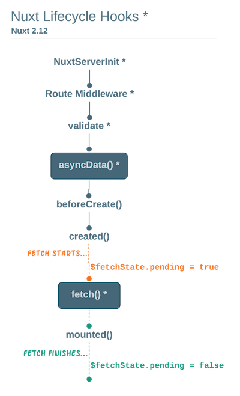

# nuxt_tutorial01
[Build a dev.to clone with Nuxt new fetch](https://nuxtjs.org/ja/tutorials/build-dev-to-clone-with-nuxt-new-fetch)

Repo : https://github.com/bdrtsky/nuxt-dev-to-clone

---

## memo

### vue-content-placeholders

> Vue addon for rendering fake content while data is fetching to provide better UX and lower bounce rate.

データ取得するまでにプレースホルダーを表示しておくアドオン

### vue-observe-visibility

要素が画面外にある場合描画しないようにするアドオン

### fetch()

参考 : https://time-is-life.fun/nuxt-2-12%E3%81%A7%E5%B0%8E%E5%85%A5%E3%81%95%E3%82%8C%E3%81%9F-fetch-%E3%81%A3%E3%81%A6%E3%81%A9%E3%82%93%E3%81%AA%E3%82%82%E3%81%AE%EF%BC%9F/

createdとmountedの間で実行

- クライアントサイドで実行される為、thisが使える
- Vuexを使わずアクセスできる
- keep-alive 等でコンポーネントキャッシュできる
- $fetchState.pending : placeholderなどに活用できる

### .envファイル

process.env.*** で利用できる

注意事項
- asyncDataで使う際、ページ遷移時にundefinedになる
- nuxt.config.jsでenv設定をしておくことで対応可能
- 参考 : microcms-nuxt-jamstack-blog